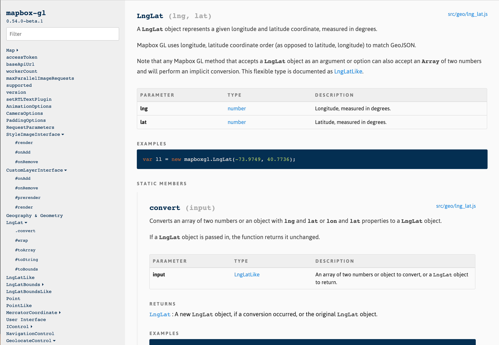

# documentation-theme-light

An alternative theme for [documentation.js](https://github.com/documentationjs/documentation). Original author: Author [Maya Gao](https://github.com/mayagao).



## Usage

1. Install theme: `npm install docjs-theme@ur300/documentation-theme-light`
2. Use theme in documentation.js call. For instance:

   ```
   documentation build index.js -f html -o docs --theme node_modules/docjs-theme
   ```
